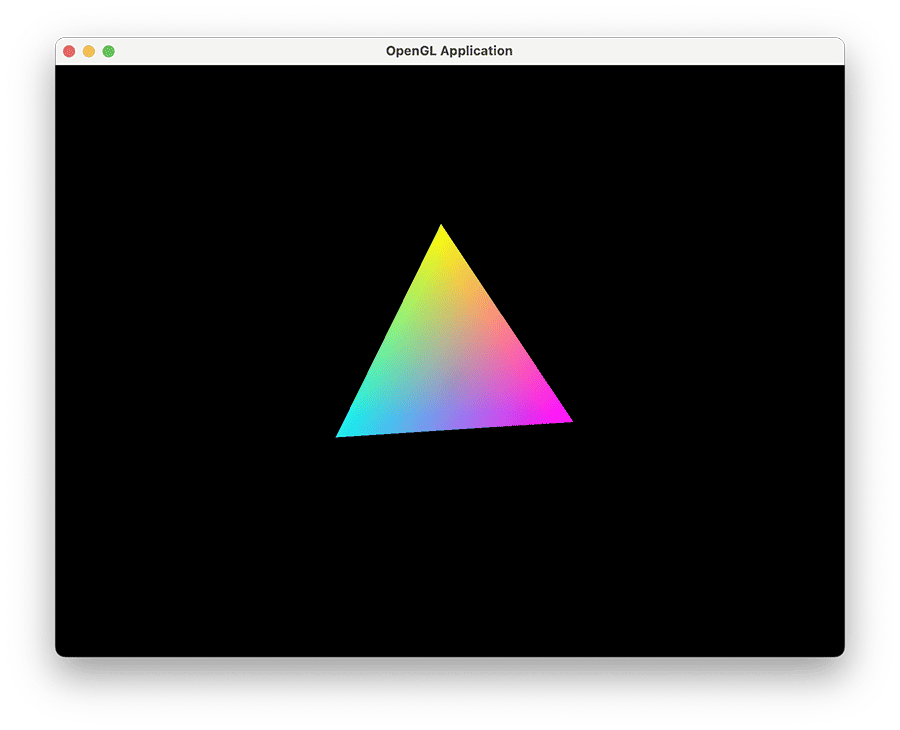

# gls-box

This is a cross-platform C++ project with OpenGL support.

## Toolchain
- Shell
- Pip
- CMake
- Conan

If you have pip installed, you can install dependencies with the following command:
```bash
./scripts/init.sh
```

## Build and run
```bash
./scripts/build.sh
```

This script supports the following options:
- `--debug` or `-d`: Build in debug mode.
- `--build-only` or `-b`: Only build the project without running it.
```bash
Usage: ./scripts/build.sh [--debug|-d] [--build-only|-b]
```

## Preview

